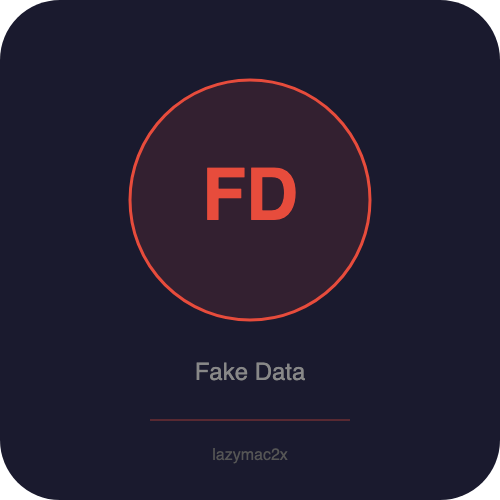

<p align="center"></p>

[](https://lazymac2x.github.io/lazymac-api-store/) [](https://coindany.gumroad.com/) [](https://mcpize.com/mcp/fake-data-api)

# fake-data-api

[](https://www.npmjs.com/package/@lazymac/mcp)
[](https://smithery.ai/server/lazymac/mcp)
[](https://coindany.gumroad.com/l/zlewvz)
[](https://api.lazy-mac.com)

> 🚀 Want all 42 lazymac tools through ONE MCP install? `npx -y @lazymac/mcp` · [Pro $29/mo](https://coindany.gumroad.com/l/zlewvz) for unlimited calls.

Lightweight fake/mock data generation REST API + MCP server. Zero external data dependencies -- all generators are algorithmic and built from scratch (no faker.js).

## Quick Start

```bash
npm install
npm start        # REST API on http://localhost:3800
npm run mcp      # MCP server (stdio)
```

## Docker

```bash
docker build -t fake-data-api .
docker run -p 3800:3800 fake-data-api
```

## REST API Endpoints

All endpoints return `{ count, data }` JSON.

| Method | Path | Params | Description |
|--------|------|--------|-------------|
| GET | `/api/v1/health` | - | Health check |
| GET | `/api/v1/person` | `count`, `locale` (en/kr) | Person profiles |
| GET | `/api/v1/text` | `count`, `type` (word/sentence/paragraph), `wordCount` | Lorem ipsum |
| GET | `/api/v1/number` | `count`, `min`, `max`, `type` (int/float), `decimals` | Random numbers |
| GET | `/api/v1/uuid` | `count` | UUID v4 |
| GET | `/api/v1/password` | `count`, `length`, `complexity` (low/medium/high) | Passwords |
| GET | `/api/v1/address` | `count`, `country` (US/KR) | Addresses |
| GET | `/api/v1/color` | `count`, `format` (hex/rgb/hsl) | Colors |
| GET | `/api/v1/date` | `count`, `type` (past/future/between), `years`, `from`, `to` | Dates |
| GET | `/api/v1/creditcard` | `count` | Test credit card numbers |
| GET | `/api/v1/ip` | `count`, `version` (v4/v6) | IP addresses |
| GET | `/api/v1/url` | `count` | URLs |
| GET | `/api/v1/company` | `count` | Company names |
| GET | `/api/v1/email` | `count` | Emails |
| GET | `/api/v1/phone` | `count`, `country` (US/KR) | Phone numbers |
| POST | `/api/v1/custom` | body: `{ schema, count }` | Custom schema |

### Custom Schema

POST `/api/v1/custom` with a JSON body:

```json
{
  "schema": {
    "name": "person.fullName",
    "email": "person.email",
    "age": "number:18-65",
    "bio": "text.sentence",
    "id": "uuid",
    "joinedAt": "date.past"
  },
  "count": 5
}
```

Available specs: `person.firstName`, `person.lastName`, `person.fullName`, `person.fullNameKr`, `person.email`, `person.phone`, `person.phoneKr`, `person.profile`, `person.profileKr`, `address`, `address.us`, `address.kr`, `company`, `text.word`, `text.sentence`, `text.paragraph`, `uuid`, `date`, `date.past`, `date.future`, `color.hex`, `color.rgb`, `color.hsl`, `password`, `creditCard`, `ip`, `ip.v6`, `url`, `boolean`, `number:MIN-MAX`, `float:MIN-MAX`.

## MCP Server

Add to your MCP client config:

```json
{
  "mcpServers": {
    "fake-data": {
      "command": "node",
      "args": ["/path/to/fake-data-api/src/mcp-server.js"]
    }
  }
}
```

Tools: `generate_person`, `generate_text`, `generate_number`, `generate_uuid`, `generate_password`, `generate_address`, `generate_custom`, `generate_email`, `generate_date`, `generate_color`, `generate_ip`, `generate_url`, `generate_creditcard`.

## Data Types

- **Names**: English + Korean (first, last, full)
- **Email**: Realistic with randomized domains
- **Phone**: US (+1-xxx-xxx-xxxx) and KR (010-xxxx-xxxx) formats
- **Address**: US (street/city/state/zip) and KR (district/city) formats
- **Company**: Generated from prefix + suffix combinations
- **Text**: Lorem ipsum words, sentences, paragraphs
- **Numbers**: Integer and float with configurable range
- **Dates**: Past, future, or between two dates (ISO 8601)
- **UUID**: v4 format
- **Colors**: Hex, RGB, HSL
- **Passwords**: Configurable length (4-128) and complexity
- **Credit Cards**: Visa and Mastercard test patterns
- **IP**: IPv4 and IPv6
- **URLs**: Random protocol/domain/path

## License

MIT

<sub>💡 Host your own stack? <a href="https://m.do.co/c/c8c07a9d3273">Get $200 DigitalOcean credit</a> via lazymac referral link.</sub>
